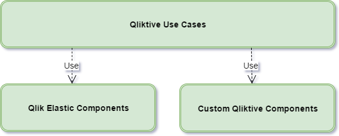

# Qlik Elastic - Early Adopter Info

This is the top-level information repo for Qlik Elastic.

## Terminology

Terminology used in Qlik Elastic documentation can be found in [Terminology](./docs/terminology.md).

## Qlik Elastic Deliverables

The Qlik Elastic offering consists of deliverables of different categories.

Each category of deliverables is described below.

### Qliktive Use Cases

A fictive company, called **Qliktive**, implements solutions on top of Qlik Elastic. These solutions realize different use cases that leverage the power of the QIX Engine and are used as our showcases of Qlik Elastic. Each Qliktive use case is developed in a repo of its own.

Currently, one use case is provided. As Qlik Elastic is being developed, more use cases will be added.

- Use Case [Custom Analytics UI](./docs/use-cases/use-case-custom-analytics/README.md)

### Qlik Elastic Components

These components are packages and microservices that can be considered as being core parts of the Qlik Elastic offering. They are typically available as ready-to-use components (e.g. as Docker images or as NPM packages). The components are developed to be generic and it is likely that they will be used in most solutions built on Qlik Elastic. Each such component is developed in a separate repo. Some of these components will be available as open source, and some may not. For example, the QIX Engine is only available as a Docker image in Qlik Elastic.

### Custom Qliktive Components

These components are packages and microservices that are developed specifically for a certain Qliktive Use Case. As such, they are not generally re-usable between different solutions. The idea is rather to provide examples and with some parts that can be further built upon for any new solution based on Qlik Elastic. Each such component is developed in a separate repo.

Since these components are more of example implementations, they do not come with the same level of support from Qlik as the core Qlik Elastic Components described above.

## Qlik Elastic Testing Strategy
Components, microservices, and the example use-case implementations are subject to the [Qlik Elastic Testing Strategy](./docs/testing-strategy.md).
