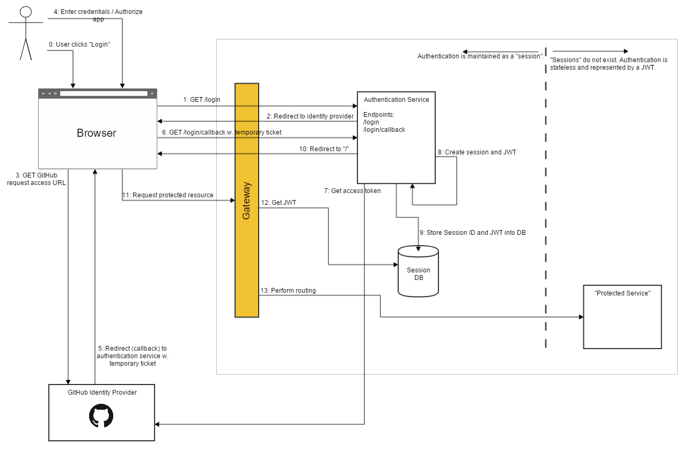

# Authentication

This document explains how authentication will take place in the Qliktive example environment.

## Design rationale

This design was created with the following assumptions/requirements in mind:
* Third party identity provider integration.
* It should be possible to login.
* It should be possible to logout. Note: logout will not be implemented in this first phase.
* All back-end services depends on JWTs as the means of authentication.
* WebSockets MUST work (i.e. we cannot depend on being able to set headers on the HTTP upgrade request).

Note: This design aims to solve interactive login scenarios. Accessing services programmatically requires a different mean of authorization (e.g. by the use of API-keys). The proposed solution is flexible enough to allow future support for API-keys if needed.

These assumptions/requirements are realized by:
* GitHub has been selected as the Identity Provider, but it could easily be replaced by any OAuth2 compatible identity provider.
* To handle login/logout, the concept of a session is needed. The session will be maintained in a session database. The session identifier will be set in a client-side session cookie.
* As back-end services utilizes JWTs (which are stateless and cannot be revoked), JWTs are associated with sessions (which by definition represents a state). I.e. JWTs are stored in the session database.
* JWTs MUST NOT be sent to the client. If a JWT is leaked into client space, there is no way of revoking the JWT (i.e. not possible to logout).
* Logout is realized by removing the session from database.
* The session cookie will be included in the WebSocket HTTP upgrade request.

The following components are involved in authentication:

| Component | Responsibility |
|-----------|----------------|
| Gateway | <ul><li>Routes traffic to designated services.</li><li>Transforms stateful sessions into stateless JWTs.</li><ul> |
| Identity Provider | <ul><li>Provide identifiers for users who wish to interact with the system.</li><li>Verifies user credentials.</li></ul> |
| Session DB | <ul><li>Keeps track of logged in users by storing sessions.</li></ul> |
| Authentication Service | <ul><li>Interacts with the Identity Provider.</li><li>Create sessions.</li><li>Issues JWTs.</li><li>Maintains the session database.</li></ul> |

## Login sequence diagram

### 0 and 1: Initiate login sequence
The login sequence is initiated (0) when:
1. the user clicks the login button, or
2. when the user requests a protected resource that requires authentication

Either way, the browser will request the login endpoint which is routed to the authentication service (1).
Note: If the login sequence is initiated by requesting a protected resource, the Gateway will direct the user to /login  (not shown in the above sequence chart).

### 2, 3 and 4: Identity provider interaction
The user will be redirected to the GitHub identity provider, application specific payload, such as the client ID will be added to the URL (2). The "request GitHub access page" will be requested and displayed (3). GitHub will request tThe user will have The displayed page will request the user to login (if not logged in already). The user will decide whether to grant access or not. Note: this is a one-shot, once our application has been granted access no additional UI will be displayed (4).

### 5 and 6: Redirect (callback) to Authentication Service
Once access has been granted, the user will be redirected (5) back to the Authentication Service with a one time authorization code (6).

### 7, 8, 9 and 10: Exchange authorization code for an access token
The Authentication Service will exchange the temporary authorization code for a permanent access token (7). At this point the user is considered to be logged in.
Next, a session and a JWT is created (8) and stored into the session database (9). Finally, the user is redirected back to original URL, the session ID is set as a cookie (10).

### 11, 12 and 13: Request protected resources
Once logged in, the user may request a protected resource, e.g. the engine service (11). The Gateway will pick up the session cookie and use its value to fetch the JWT from the session database (12). When routing the request, the Gateway will remove the cookie and add the JWT in the Authorization header using the Bearer schema (13).

## Threats and Countermeasures

| Reference | Risk | Threat | Countermeasure | Implementation | Verification | Comment |
|-----------|------|--------|----------------|----------------|--------------|---------|
| Ref in seq. | L/M/H | THREAT | COUNTERMEASURE ||||
| 10 | H | An attacker exploits a weakness in the cookie configuration|The session cookie must:<ol><li>have the `Secure` attribute set</li><li>have the `HttpOnly` attribute set</li></ol> |
| 11 | H | An attacker sets the _Authorization_ header from the outside | The gateway must reject all requests containing the _Authorization_ header.||||
| 13 | M | An internal service accidentally leaks _Authorization_ header in response | The gateway must remove all _Authorization_ headers in responses||||

## Further reading

* [https://jwt.io/](https://jwt.io/)
* [http://cryto.net/~joepie91/blog/2016/06/13/stop-using-jwt-for-sessions/](http://cryto.net/~joepie91/blog/2016/06/13/stop-using-jwt-for-sessions/)
* [http://cryto.net/~joepie91/blog/2016/06/19/stop-using-jwt-for-sessions-part-2-why-your-solution-doesnt-work/](http://cryto.net/~joepie91/blog/2016/06/19/stop-using-jwt-for-sessions-part-2-why-your-solution-doesnt-work/)
* [https://developer.github.com/v3/oauth/](https://developer.github.com/v3/oauth/)
