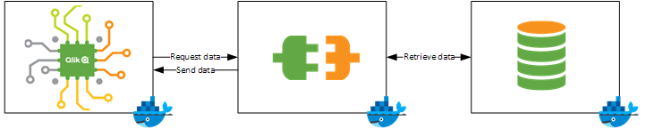

# Data Loading API

!!! warning "Experimental feature"
    This feature is in an experimental state. Use with caution
    since this feature may change in the future.

Typically, a connector is implemented as a stateless Docker container that
sits between the Qlik Associative Engine and the data source, as shown below.




The Qlik Associative Engine communicates with the data source through the
[Data Connector gRPC API](data-connector-grpc.proto).
The data connector fetches data from the source and sends it to the engine
in a consumable format.

!!! Tip
    The simplest way for the Qlik Associative Engine to discover
    available connectors is to use the GrpcConnectorPlugins.

## GetData function

When loading data, the Qlik Associative Engine sends one gRPC `GetData` call per table,
and the server returns a stream of data chunks.

``` proto
rpc GetData(GetDataOptions) returns(stream DataChunk) {}
```

### Input

The input to the `GetData` call must contain a connection string, a username, a password,
and a query statement.
The connection string and query have a connector-specific format.
For example, the input structure might look like this:

``` json
{
  connection: {
    connectionString: 'hostname=localhost',
    user: 'test',
    password: 'test'
  },
  parameters: {
    statement: '{ "collection": "airports" }',
  }
}
```

### Output

The `GetData` call returns a stream of data chunks.

The connector sends data from the data source to the
Qlik Associative Engine, translating the data piece by piece.
The connector also supplies a gRPC header `x-qlik-getdata-bin` that contains metadata.

### Data chunks

To improve engine performance, data is sent column by column.
Each column holds the corresponding column values for all rows in the chunk,
and as column values have the same format, gRPC can encode the data more efficiently.

!!! Note
    Protobuf is the underlying encoding technology used in gRPC.

In addition, each column can be saved in several different formats, such as strings, floating point numbers,
and integers.
The connector also uses a structure called `ValueFlag` to
indicate the format of the data. This is useful when, for example, specifying date formats.

``` proto
message DataChunk {
  repeated Column cols = 1;
}
```

``` proto
message Column {
  repeated string strings = 1;
  repeated double doubles = 2;
  repeated sint64 integers = 3;
  repeated ValueFlag flags = 4;
}
```

### Metadata

The `GetDataResponse` message is encoded and sent as metadata in the `x-qlik-getdata-bin` header.

``` proto
message GetDataResponse {
  repeated FieldInfo fieldInfo = 1;
  string tableName = 2;
}
```

## Examples

We recommend that have a look at the respective example projects below to
see a full working connector.

!!! Tip
    For large data sets, it is important to choose a language that meets your performance requirements.
    Although gRPC is a fast protocol, it still comes with some computational overhead, especially in
    managed/interpreted languages like JavaScript.
    Go seems to be fast enough to saturate a gigabit line, which covers most requirements.
    For large requirements however (10Gbps line or faster), you will need to build your connector using C/C++.

### PostgreSQL connector built with Go

[github.com/qlik-ea/postgres-grpc-connector](https://github.com/qlik-ea/postgres-grpc-connector)

### MongoDB connector built with JavaScript

[github.com/qlik-ea/mongodb-grpc-connector](https://github.com/qlik-ea/mongodb-grpc-connector)
