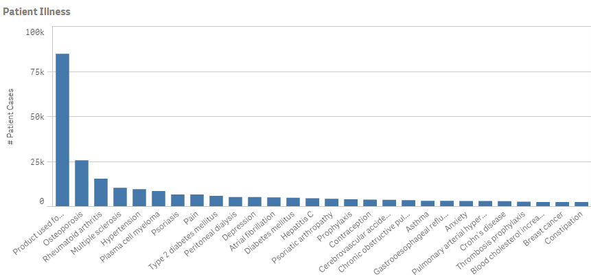
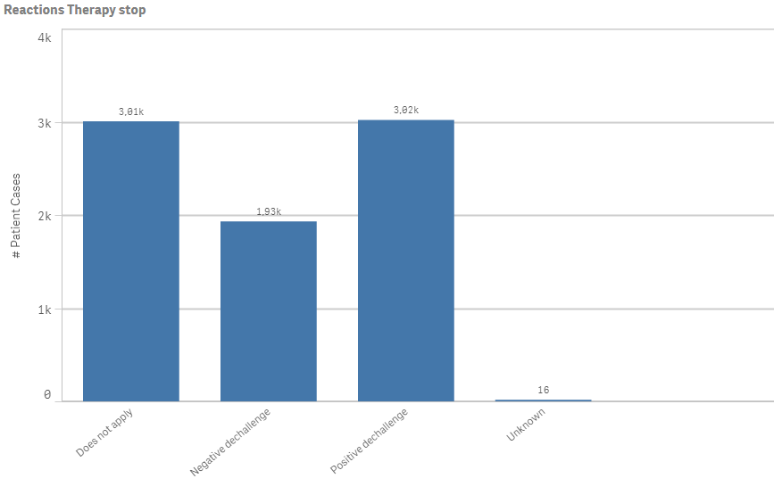
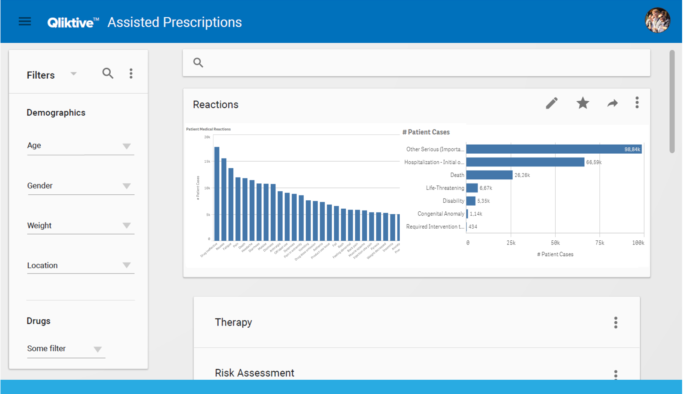

# Use case: Custom Analytics UI

WORK IN PROGRESS

## UI and visualization details

DIMENSIONS:
Medical Description Reaction: [Medical Description Reaction]

MEASURES:
\# Patient Cases: Count(Demographic_Caseid)

DIMENSIONS:
Medical Description Drug Use: [Medical Description Drug Use]

MEASURES:
\# Patient Cases: Count(Demographic_Caseid)

DIMENSIONS:
Patient Event Outcome: [Patient Event Outcome]

MEASURES:
\# Patient Cases: Count(Demographic_Caseid)

DIMENSIONS:
Patient Age Group: [Patient Age Group]

MEASURES:
\# Death by primary suspect: Count({<[Drug Role Event] = {'Primary Suspect Drug'},
  [Medical Description Reaction] = {'Death'} >}Demographic_Caseid)

DIMENSIONS:
Manufacturer Code Name: [Manufacturer Code Name]

MEASURES:
\# Drug Cases: Count(Drug_caseID)

DIMENSIONS:
Reaction Therapy Stop:[Reaction Therapy Stop]

MEASURES:
\# Patient Cases: Count(Demographic_Caseid)

## UI Overview

