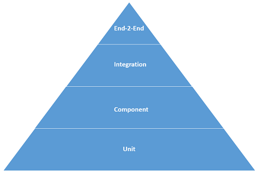
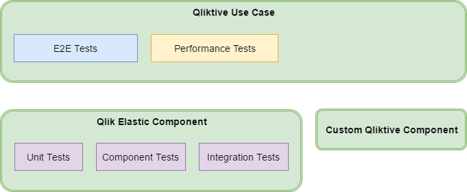

# Qlik Elastic Testing Strategy

## Test levels

Qlik Elastic microservices and the Qlik Elastic use cases are developed with a test strategy
that defines different test levels in a typical test pyramid set up.

* The pyramid describes the testing life-cycle of a component
* The pyramid can be viewed as a vertical timeline for a component
* The pyramid describes from where we should be extracting the most test coverage

### End-2-End

The topmost test level applies to end-to-end scenarios
which for Qlik Elastic typically is testing the actual deployment from end-user perspective,
typically acceptance tests and customer oriented tests.
Can also include testing specific interactions between services collaborating in the system
by inspecting internal behavior of the system.

The next three lower test levels apply to microservices/components.
How much testing and what specific test environments that are developed at each of these levels
also depends a lot on the characteristics of the microservice/component.
Each microservice/component shall provide information on how tests at each of these levels apply.

### Integration

Integration tests are fully automated tests that run on a "live" environment **without any mocked dependencies**
in order to secure a continuous integration and delivery workflow.
This is done to ensure that contracts previously fulfilled on a component level also work when not mocked,
as some dependencies between services cannot be tested mocked.

### Component

Component tests limits the scope of the exercised software to a portion of the system under test,
manipulating the system through internal code interfaces
and **using test doubles to isolate the code under test** from other components.
Testing a component is preferably done via contract testing, automation, and manual testing (if needed and applicable).
Contract testing should be highlighted as a key component in securing inter-service operability
in a microservice architecture.

### Unit

Unit tests exercise the smallest piece of testable software to determine whether it behaves as expected.
A unit test should be **executed in complete isolation** and have no need to have a full, running system.
All code that is being developed, no matter in which part of the stack,
should be delivered together with corresponding unit tests, and is enforced by code review.

## Deliverables Test Structure

The image below shows the test structure of the different deliverables of Qlik Elastic
and which tests that apply to each category.
Read about categories of deliverables [here](../README.md).

For a **Qliktive Use Case**, both E2E tests and performance tests are developed.
These ensure that Qlik Elastic fulfills the requirements of the specific use case,
and indirectly the functional and non-functional requirements of the Qlik Elastic product.

For a **Qlik Elastic Component**, the full suite of unit, component, and integration tests apply.
These components come with full support from Qlik since they are core parts of the Qlik Elastic product offering.

For a **Custom Qliktive Component**, an ad-hoc testing is applied.
These components are example implementations and are likely not generally applicable.
Tests are developed in an on-need basis from case to case.
