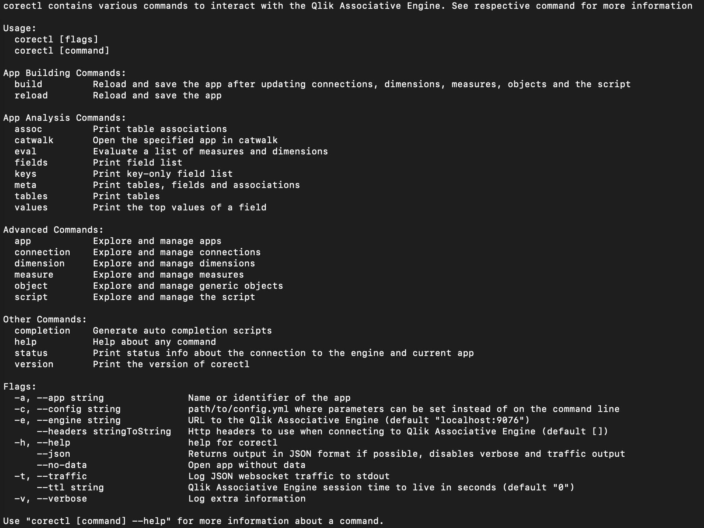

# Corectl

Qlik Core Control (corectl) is a tool that delivers a command line interface (CLI) for the Qlik Associative Engine. With
corectl you can interact with your apps, objects, and data.

The main use cases are:

* View: list applications, view and query data, and evaluate expressions
* Develop: create, update and model a Qlik application
* Script: support scripting and automation of common tasks

Download instructions for corectl can be found [here](https://github.com/qlik-oss/corectl#download).
