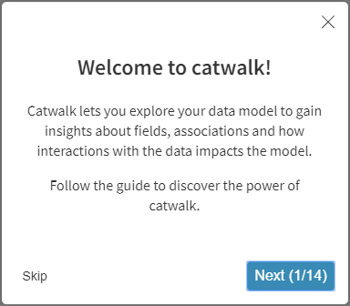

# January 2019

New year, new features, new solutions. In this update we will share some news about our latest tool releases.

## Data model experience

Our data modelling tool, catwalk, has finally reached a maturity level where we feel comfortable to move it from an
experimental state. Since it has continuously been published on [catwalk.core.qlik.com](https://catwalk.core.qlik.com)
you will not feel lost if you visited before, but here are some of our latest additions:

### Tool walk-through

The first time you enter the tool you will be greeted with a guide walking you through the different parts of the
application. It will describe how you can analyse your data model, how you interpret the different colours, associations
lines and what the numbers mean.

The guide is based on your chosen application and if you would like to pull it up again in the future you can do so by
right click on the catwalk logo (top right in the application).

### More field descriptions

Another feature we added to provide a better understanding of the data model is extended field information. Previously
you could only reach field information through hoovering over the field card to view a condensed version of the field
data. With the new feature you can also click on the three dots in the top right corner of a field to get a more
descriptive information card with explanation.

### Reload in progress

## Improvements in the corectl tool

Corectl has not been forgotten this month but received smaller improvements such as:

* Print event messages in verbose mode.
* Ability to set a free text connection string when configuring a connector.
* Better error messages when working with an engine without correct license (no license and engine has expired).

## Upcoming

In February 2019, we will focus on moving corectl from experimental state to a 1.0.0 release. Stay tuned!

* [slack #qlik-core](https://qlik-branch.slack.com/channels/qlik-core)
* [github](https://github.com/qlik-oss)
