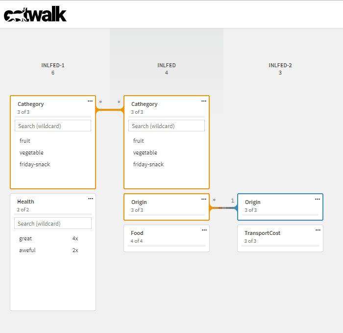
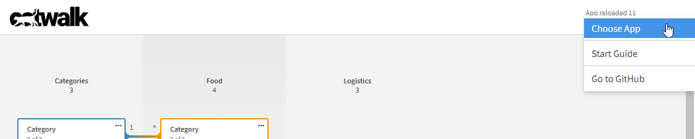
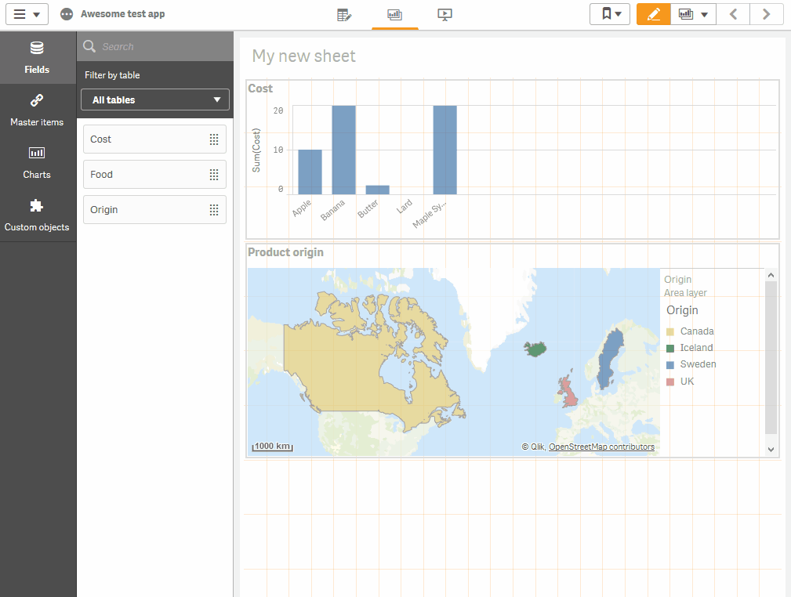
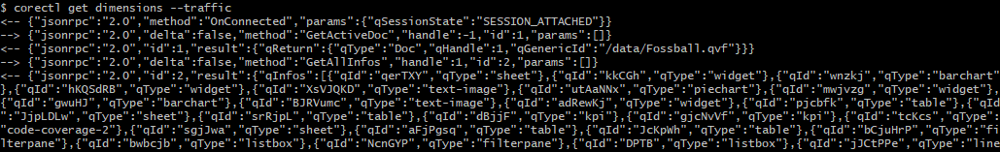

# February 2019

Welcome to the February 2019 Qlik Core update. We're highlighting a couple of important changes and
improvements which we hope you will like.

## Usability and design changes in catwalk

Since being moved to stable last month, we've made several small usability improvements and design changes along with a
couple of bug fixes.

### QlikView select excluded coloring

We have added support for the *select excluded* selection state, which can be used for deeper data model analysis. A value enters the selected excluded state because the value was first selected, and then excluded by a selection in another field. This value will be described in catwalk with *green on light grey background*.

!!! Note
    Please note the color scheme follows QlikView coloring and corresponds to *dark grey and check mark* in Qlik
    Sense.

More information about Qlik's selection model can be found in the
[Qlik Sense help pages](https://help.qlik.com/en-US/sense/Subsystems/Hub/Content/Sense_Hub/Selections/associative-selection-model.htm).



### Reworked top bar with new menu

The top bar in catwalk has been reworked, adding a new menu containing project-wide links. Apart from the existing link
to the guide, you can also navigate to the Engine documents overview through *Choose App*.



### Guide for Qlik Sense Enterprise integration

Since a lot of our users come from a Qlik Sense background, we have created a
[guide](https://github.com/qlik-oss/catwalk#qlik-sense-enterprise) which describes how to open documents from Qlik Sense
Enterprise in catwalk.

When the catwalk URL is white-listed in your deployment, you can also use our Qlik Sense extension to quickly open the
current application's data model in catwalk.



## Improvements in corectl

To prepare corectl for a 1.0.0 release, we improved the existing tests and created a plan for the remaining work.
Awaiting the release, we added a couple requested changes:

### Improved logging

To simplify debugging, we added the flag `--traffic` which logs JSON websocket traffic to stdout. This might come in
handy if you would like to dig deeper into what is happening after you execute a command (and especially if it fails).



### Support for nested objects

We've also been asked if we could support nested objects (parent <-> children) such as sheets and their
content. With the latest [0.4.0 release](https://github.com/qlik-oss/corectl/releases/tag/v0.4.0), we added support for these
to make it easier to build full Qlik applications.

The objects are set by adding the `--objects` parameter to corectl or in the configuration file:

```yaml
objects:
  - ./object-definitions.json
```

An example of a nested structure can be found in our
[corectl repo](https://github.com/qlik-oss/corectl/blob/master/test/project2/sheet.json).

## Guide connecting to a local PostgreSQL

We also received some questions around setting up a local PostgreSQL for the testing and debugging of our
[PostgreSQL connector](https://github.com/qlik-oss/core-grpc-postgres-connector). This prompted us to create a
[guide](https://github.com/qlik-oss/core-grpc-postgres-connector/blob/master/local-postgres.md) to help the process. Take a look at this if you are starting a new project and are interested in how to quickly get up and running with Qlik Core and connectors.

## Knowledge article - Qlik Core tooling

Finally, we released a [Qlik Branch Knowledge article](https://developer.qlik.com/knowledge/5c5302d4bf85ce00175efd18)
providing a walk-through of our development tools — corectl and catwalk. Through a beer scoring app tutorial, it gives an example of a developer flow showing data loading, data modeling and how to analyze your data model while developing.

Give it a try and, as always, don't be afraid to give us feedback on what you like and what you are missing.

## Upcoming

In March, we plan to move corectl from the experimental state to a 1.0.0 release. Stay tuned!

* [slack #qlik-core](https://qlik-branch.slack.com/channels/qlik-core)
* [github](https://github.com/qlik-oss)
