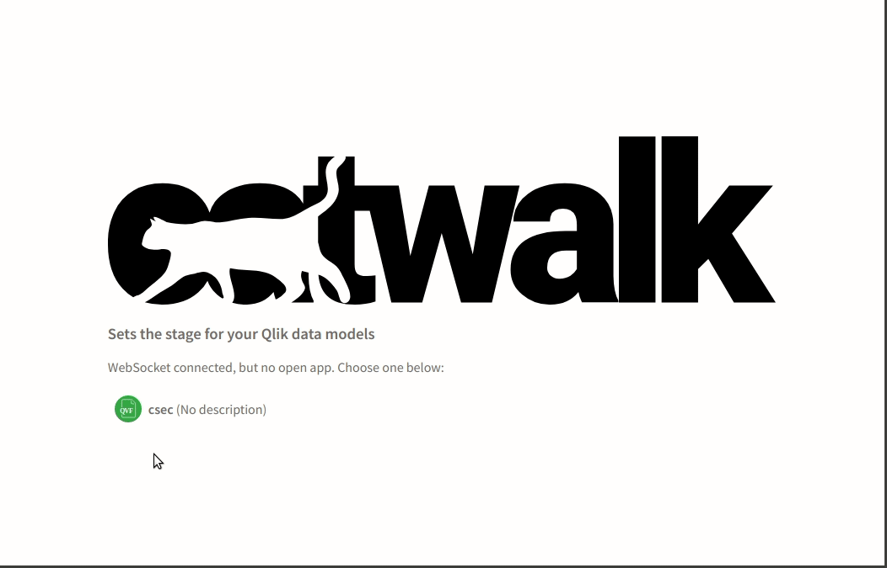
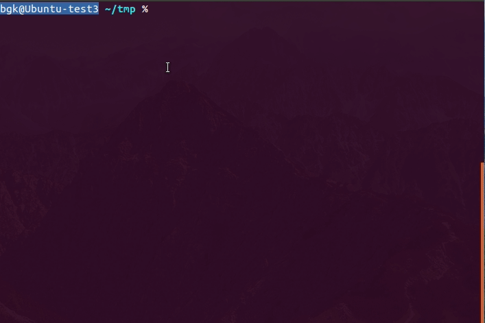

# March 2019

Welcome to the March 2019 Qlik Core update. We're highlighting a couple of important changes and improvements which we
hope you will like.

## Engine security enhancement

To follow security best practices, the Qlik Associative Engine Docker image is changing its
user and group from `nobody:nobody` to `1910:1910`. You can read more about using a unique UID/GID here:
[https://docs.docker.com/develop/develop-images/dockerfile_best-practices/#user](https://docs.docker.com/develop/develop-images/dockerfile_best-practices/#user).

**If you are on a Mac or Linux OS and using Docker volume mounts, you may need to change the owner of the volume files.
You can do that with the following command:**

```bash
chown -R 1910:1910 /YOUR-MOUNT
```

This change is effective for Qlik Associate Engine version 12.350.0.

## Introducing hamus.js

We grew tired of typing the same code every time we created a new react.js solution, so we decided to consolidate
reusable code into a new utility library called [hamus.js](https://github.com/qlik-oss/hamus.js). The repo utilizes
the new React Hook API and offers a set of hooks. This simplifies the usage of enigma.js models and layouts,
as well as rendering picasso.js charts based on hypercubes. We will add more hooks as we identify reusable code in
projects and get your feedback. So if you have ideas, feel free to share them as issues in the GitHub repository below.

The repo also comes with an example to get you started. Check it out at [hamus.js](https://github.com/qlik-oss/hamus.js)
.

## Usability fixes in catwalk

To increase usability when loading large applications (or with slow connections) we have added a loading screen.



## On the path to a corectl 1.0.0 release

We're in the last phases of finishing a 1.0.0 version of corectl. The focus of this release is to remove the
experimental flag and make the command structure stable. Along with necessary consistency changes in the API, we are
adding a couple of requested features in the latest 0.5.0 release.

### Auto completion

To simplify entering commands, arguments and flags, we have added support for bash completion in bash and zsh. Apart
from speeding up things when entering commands, it lists available objects for `get` commands (dimension, measure,
connection and object). This will save one call to corectl to retrieve the IDs of the object.



Have a look at the [README](https://github.com/qlik-oss/corectl#usage) for more information on how to enable the
feature.

### Better error messages and examples

The corectl documentation has been improved with better error messaging and more examples of the different commands.
For example, take a look at the new [Examples Chapter](https://github.com/qlik-oss/corectl#examples) in the README.

### Smaller fixes

We have also fixed smaller issues such as:

* passing the username and password to connectors in the config file
* better error messaging when failing to create an application
* notifying the user of new corectl versions when running the version command
* removing multiple connections through `remove connections`

As always, you can follow the development in the [corectl repo](https://github.com/qlik-oss/corectl).

## Upcoming

In April, we're working on corectl 1.0.0 and looking further into our connector offerings.
Stay tuned!

* [slack #qlik-core](https://qlik-branch.slack.com/channels/qlik-core)
* [github](https://github.com/qlik-oss)
