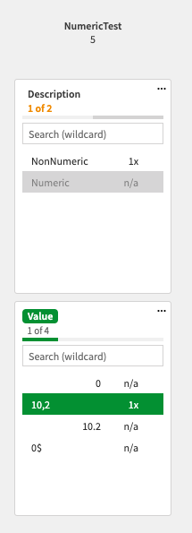
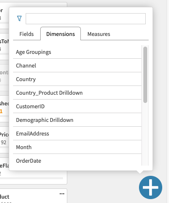

# May 2019

Welcome to the May 2019 Qlik Core update. We're highlighting a couple of important changes and improvements which we
hope you will like.

## Release of corectl 1.0.0

After a final touch up we released corectl as a stable 1.0.0. As described in
[previous update](2019-04.md#corectl-100-beta-release) we changed the command structure and with this release we
confirmed it.

### Installation through snap

For our Linux users out there we have added support for installation of latest corectl through
[snap](https://snapcraft.io/). Install with:

```bash
snap install qlik-corectl
```

and update

```bash
snap refresh qlik-corectl
```

Even though the package name has a prefix `qlik-` the installed binary will be called corectl.

### Support for multiple entities in files

We have added support for having multiple entities in object files (measures, dimensions and objects). Depending on
your preference you can add multiple objects in one json file or divide them into several.

```json
[
    {
        "qInfo": {
            "qId": "avgSize",
            // ...
        }
    },
    {
        "qInfo": {
            "qId": "entries",
            // ...
        }
    }
]
```

### Other fixes

* Fix bash completion in Widows Subsystem for Linux (WSL)
* Additional information in the version command

## New file streaming API in engine

A new file streaming API has been released in engine, giving us a new way of working with remote files.
Functionality wise, the feature is similar to the folder connector used to access local files. If you are familiar with
this you will feel home since load script functions such as `Load`, `Store` and `FileSize()` will work as expected.

The feature is intended to enable a user to load or store files from external sources such as an S3 bucket, Dropbox or
other remote storage services. With the release we have provided a
[S3 file connector example](https://github.com/qlik-oss/core-grpc-s3-file-connector) and a
[tutorial](../tutorials/data-loading/remote-files.md) explaining its usage.

## Enhancements in catwalk

We have continued to work with the feedback we receive (keep it coming!) and have some updates you might like.

### Right align numeric values

A common activity during data modeling is sanitation of data. Dirty data such as numbers with trailing spaces, null
values or incorrect decimal character may introduce errors in measurements which need to be found and fixed. To support
these cases numeric values will be right aligned to differentiate against string values



### Use of hamus.js

Since the release of hamus.js we could refactor some of the catwalk code to use the hamus.js hooks for engine
communication. If you are interested, take a look for more examples on how to use hamus.js.

### Separate tabs for fields, dimensions and measures

With a growing application the number of fields, dimensions and measures might get crowded and hard to navigate. To
remedy this we divide the categories in tabs.



### Your data will not leave the browser

On and off, we receive questions if the engine data is exposed when using the hosted catwalk version. To cut a long
answer short, stay calm, no data is sent outside your browser session and your engine. More information can be found in
our [data policy](https://github.com/qlik-oss/catwalk#data-policy).

### Other improvements

* Added possibility to remove columns in the hypercube builder.

## Trial license

The previous trial license has reached end of life. If you still need to prototype and test out Qlik Core without
the limitations of the community version, please fill in [this form](XXX).