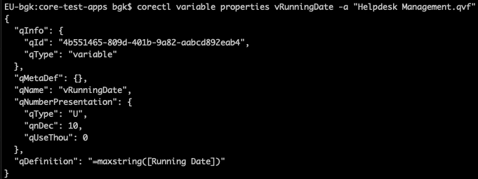

# June 2019

Welcome to the June 2019 Qlik Core update. There are a number of updates in this version that we hope you will like,
some of the key highlights include:

## New features in corectl

Since the launch of corectl we have received a couple of feature request from our users which we loved to implement.
Thank you Jesse Paris for all your feedback!

The new version 1.2.0 includes all the latest features. As always, you can get the latest by using `brew upgrade`,
`snap refresh` or downloading from [GitHub](https://github.com/qlik-oss/corectl/releases).

### Connect to Qlik Sense with certificates

If you would like to connect to Qlik Sense using certificates (instead of JWT validation) we have added support through
the new certificates parameter.

```bash
$ corectl app ls -certificates ./certs

xxx
```

You can read more about the feature in the
[corectl config](https://github.com/qlik-oss/corectl/blob/master/docs/corectl_config.md#certificates) chapter.

### Unbuild - export app content


The new experimental command, `unbuild`, exports all dimensions, measures, objects, variables, connections and load
script from an existing application. This has been a requested feature from users who want to use existing objects in
multiple applications and for those who would like to extract and version manage application content outside the app
itself.

Usage:

```bash
corectl unbuild -a app-id
```

This will create a new folder named `app-id-unbuild`. If you would like to use another directory just add `--dir` to
your command

```bash
corectl unbuild --dir ./output -a app-id
```

### Variables and bookmarks

We have extended support for application entities to include variables and bookmarks. Variables follow the same structure
as other advanced commands (`layout`, `ls`, `properties`, `rm`, `set`). Bookmarks is similar but lacks the `set` command.

Example showing properties for a specified variable:



### Import applications

Do you have a couple of Qlik applications you would like to try out in a new Qlik Core container? Do you want to
automate importing application to an engine instance? The new import command might be helpful for you. The command
imports a specified application to the engine and returns its provided ID.

Usage:

```bash
$ corectl app import path/app.qvf
Imported app with new ID: a0334b7f-e533-4643-9e8c-0e8b6f9fdc84
```

### Basic completion support for powershell

For those of you favoring Powershell, we have added basic completion support. With the completion enabled you can cycle
through the available commands and flags for current command.

Please look into the [https://github.com/qlik-oss/corectl#powershell](readme) for more information.

### Other fixes

* Bash completion suggest files based on required file types (e.g. *.json for objects)

## Resize columns in catwalk

Sometimes, fields, tables and values have long names which makes it hard to distinguish them from each other. In order
to fix this we introduced a table resizing. After a table size has been changed, the value will be stored in the
browser's local storage and used when returning to the application in the future.
