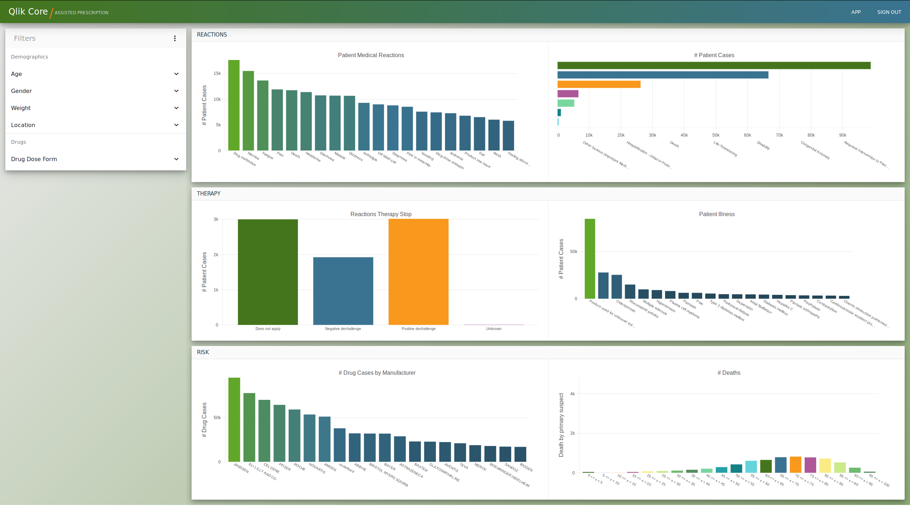
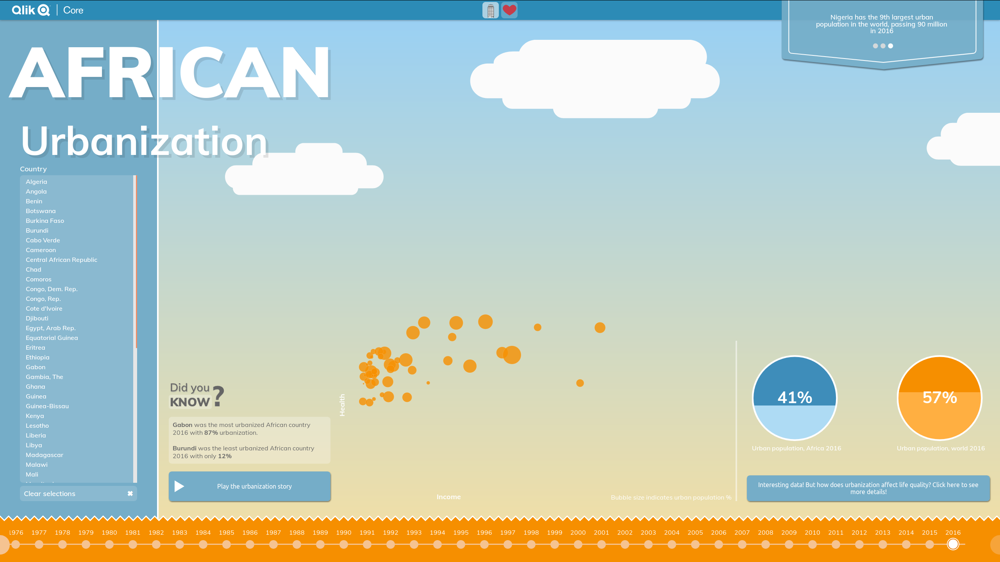

# Use Cases

## Assisted Prescription

Assisted Prescription provides an interactive application to assist doctors with drug prescriptions. Data is served
from the Qlik Core backend using a single document. Variance in user load is limited and any scaling of the application
can be manually managed.

A live demo is available at [ap.core.qlik.com](https://ap.core.qlik.com/). You need a GitHub account to log in.

This use case is good to check out if you want to explore the following aspects of Qlik Core:

* Building a custom UI on top of Qlik Core, using [picasso.js](https://github.com/qlik-oss/picasso.js) and
  [enigma.js](https://github.com/qlik-oss/enigma.js).
* Building a backend using Qlik Core to serve multiple users with a single document used by
  [Qlik Associative Engine](./services/qix-engine/introduction.md).
* Managing load from multiple users by scheduling sessions to different engines using a least-load strategy.
* Running [Mira](./services/mira.md) with Kubernetes as container orchestrator.

More info and source code of the Assisted Prescription can be found in the
[core-assisted-prescription-ui](https://github.com/qlik-oss/core-assisted-prescription-ui) and
[core-scaling](https://github.com/qlik-oss/core-scaling) GitHub repositories.

This use case was earlier deployed on a Docker Swarm cluster. You can still find the code used here:
[core-assisted-prescription](https://github.com/qlik-oss/core-assisted-prescription) GitHub repository.

## African Urbanization

African Urbanization provides a captivating experience in an infographic inspired UI which tells the story about the
urbanization in Africa from 1960 til today. Data is served from the Qlik Core backend using a single document. Large
variance in user load is anticipated which is handled by horizontal pod auto-scaling and infrastructure auto-scaling.
An overview of the flows is described in [autoscaling](./images/urbanization_autoscaling.png) and
[connection of a session](./images/urbanization_connection_of_one_session.png).

A live demo is available at [urbanization.core.qlik.com](https://urbanization.core.qlik.com/).

Look at this solution using Qlik Core if you are interested in:

* Sharing a document between multiple [Qlik Associative Engine](./services/qix-engine/introduction.md) instances using
  volumes.
* Horizontal auto-scaling of Qlik Associative Engine pods in Kubernetes using Prometheus metrics.
* Deploying a Qlik Core application on Google Kubernetes Engine (GKE) on Google Cloud.
* Automatic scaling of infrastructure with GKE.
* Running [Mira](./services/mira.md) with Kubernetes as container orchestrator.

More info and source code of the African Urbanization can be found in the
[core-scaling](https://github.com/qlik-oss/core-scaling) and
[core-scaling-ui](https://github.com/qlik-oss/core-scaling-ui) GitHub repositories.
