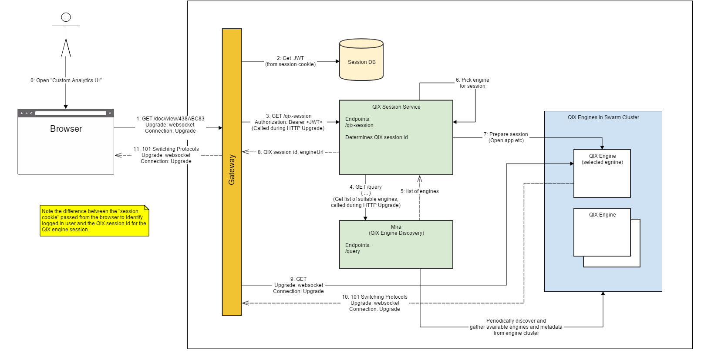

# QIX Engine Session Management
This page explains how authentication will take place in the Qliktive example environment.

## Design Rationale
The design is created with the following assumptions and requirements in mind
- Third party identity provider integration.
- It should be possible to login.
- It should be possible to logout. Note: logout will not be implemented in this first phase.
- All back-end services depends on JWTs as the means of authentication.

The following components are involved in QIX Engine session management:

| Component     | Responsibility |
|:------------- |:-------------- |
| Authentication Service | <ul><li>Interacts with the Identity Provider</li><li>Create sessions</li><li>Issues JWTs</li><li>Maintains the session database</li></ul> |
| Gateway           | <ul><li>Routes traffic to designated services</li><li>Transforms stateful sessions into stateless JWTs</li></ul>  |
| Identity Provider | <ul><li>Provide identifiers for users who wish to interact with the system</li><li>Verifies user credentials</li></ul> |
| Session DB	    | <ul><li>Keeps track of logged in users by storing sessions</li><ul> |

## Collaboration Diagram

### Steps
_This section remains to be written._

## Threats and Countermeasures 
_This section remains to be written._
